# Server Management Panel

[English](README.md) · [Türkçe](README_tr.md) · [简体中文](README_zh.md)

A self-hosted management panel written for a single Linux + Docker server. It brings monitoring, alerting, Docker and compose management, quick access to services, backups, firewall, file and database management together in one interface. Simplified Chinese is the default interface language, with English, Turkish, German, French, and Italian also available.

Designed at home-server (homelab) scale: a single container, embedded SQLite, no external database or queue. The default interface and operational console are in Simplified Chinese.

> **Version:** 2.0.0 · **Stack:** Next.js 16, React 19, TypeScript, Tailwind CSS 4, Node 24 (`node:sqlite`)

---

## Table of Contents

- [Features](#features)
- [Screenshots](#screenshots)
- [Architecture](#architecture)
- [Security model](#security-model)
- [Requirements](#requirements)
- [Installation](#installation)
- [Optional components](#optional-components)
- [Environment variables](#environment-variables)
- [Updating and rolling back](#updating-and-rolling-back)
- [Docker labels](#docker-labels)
- [External API, Prometheus, and MQTT](#external-api-prometheus-and-mqtt)
- [Languages](#languages)
- [Development](#development)
- [Project structure](#project-structure)
- [Known limitations](#known-limitations)
- [Documentation](#documentation)

---

## Features

### General

- **Overview:** live CPU, memory, disk and network usage, container count, open alerts, OS and image updates, time of the last backup, and cards you choose to pin.
- **Applications:** a card board for reaching services on the server with a single click. Categories, ordering, logo upload, and a live status dot tied to each card. Cards are auto-discovered via Docker labels. Services like Pi-hole show a widget on top of the card.
- **Home screen and kiosk:** a search box that searches cards and bookmarks together, a clock, weather (Open-Meteo, no key required), and an "is the internet working?" indicator. There's also a session-less, read-only, token-based kiosk address (`/kiosk/<token>`) for a wall-mounted tablet.
- **Command palette:** reach any screen or action quickly with `Ctrl+K` / `Cmd+K`.

### Monitoring

- **Monitoring:** CPU, memory, disk, network, and temperature history. Metrics are stored in tiers: raw data for 24 hours, 1-minute resolution for 7 days, 1-hour resolution for 90 days, 1-day resolution for 24 months. Retention periods can be changed from settings. Capacity forecasting is done for disk, RAM, and CPU ("disk may fill up in 12 days").
- **Hardware health:** sensor temperatures, mdraid, S.M.A.R.T, and ZFS pool status. On a virtual machine the panel doesn't show an empty box — it states the reason.
- **Service Status:** HTTP, TCP, ping, DNS, and container probes. Includes a 60-day uptime strip and maintenance windows.
- **Events and notifications:** Generic Webhook (DingTalk / WeChat Work / Feishu compatible), Bark (iOS push), ServerChan (WeChat), PushPlus, Telegram, Home Assistant, ntfy, Discord, and email channels, each with its own severity filter. Flap protection, repeat suppression, quiet hours, and re-reminders for unresolved critical alerts are applied to prevent a storm of false alarms. The **Timeline** merges the audit log, events, and metric spikes into a single feed ("this setting changed at 22:00, this container crashed at 22:05").
- **Logs:** container logs and journald are collected in one place and searched with SQLite FTS5. Accent-insensitive: typing "olcum" finds "ölçüm". Alert rules can be defined based on log patterns.

### Management

- **Docker:** Container, Stack, Image, Volume, Network, and Cleanup tabs.
  - Start, stop, restart, delete, and bulk-operate on containers.
  - **Dynamic Resource Quotas:** update CPU and memory limits on running containers on the fly via Docker update API without restarting.
  - **Docker Registry Mirrors:** manage and test latency of preset mirrors (e.g. 163, USTC, NJU) and automatically apply to `/etc/docker/daemon.json`.
  - **Log Truncation:** safely truncate container log files (`truncate -s 0`) without dropping stdout streams to reclaim disk space.
  - **Mobile Touch Bar in Web Terminal:** touch-friendly functional keys (Esc, Tab, Ctrl+C, Ctrl+L, Arrow keys) and zoomable font controls.
  - Live logs (with ANSI colors), an in-container web terminal (xterm.js), an in-container file browser and editor, and per-container resource graphs.
  - **Add container:** create a container by pre-filling a form from a compose file or a pulled image, then editing it.
  - **Compose editor:** ports, networks, environment variables, and restart policy are edited via a form. Before saving, a line-by-line diff is shown, a backup is taken, and it rolls back automatically on failure.
  - Generate a `docker-compose.yml` from a container that doesn't have one.
  - One-click image updates: if the new container fails to come up, the old container is automatically restored. New version tags are detected from the registry. An optional CVE check runs before updating.
  - Restart-loop and OOM detection, image layer stack visualization, volume cloning and export, network map.
- **Stack / App store:** install your own `docker-compose.yml` and manage installed stacks (`compose up`, `pull`, `restart`, `down`). Pre-checks such as port conflicts are performed before installation.
- **Database:** connect to PostgreSQL, MySQL/MariaDB, and SQLite databases, browse tables, run queries, and export results.
- **Files:** browse, download, upload, and edit under root directories allowed in settings.
- **Backup:** restic-based scheduled backups. Includes directory and Docker volume selection, retention policy, S3/rclone remote targets, snapshot listing, and one-click restore. restic is not installed on the host; every command runs in a one-off `restic/restic` container.

### Network and Security

- **Proxy:** point a domain to a service on the server (Caddy, Let's Encrypt, or a local CA). Certificate expiry tracking and dynamic DNS (Cloudflare, DuckDNS) live here too.
- **Network:** local network device discovery and inventory (with MAC→vendor mapping), notifications for new unknown devices, Wake-on-LAN, speed test history, and Tailscale peer status.
- **Port Map:** which port is held by which container or system service, and which ports are free to assign to a new container.
- **Firewall:** view, add, and delete ufw rules, and change the default policy.
- **Security:** open ports, SSH keys, fail2ban and failed login attempts, UPnP port mappings, and known-vulnerability (CVE) scanning of images with Trivy.

### System

- **Server:** a server console with ready-made command templates and optional free-form commands, system info, systemd services, reboot, and shutdown.
- **Host Tasks:** manage the host's own crontab. Instead of raw cron expressions, a friendly scheduler is used, e.g. "every N days at 06:17."
- **Users and roles:** multi-user support, custom roles, and permission-based access (RBAC), TOTP two-factor authentication, and a list of open sessions.
- **Audit Logs:** who changed what, and when. Filterable and exportable as CSV.
- **Panel Jobs:** the latest results of background jobs (metric collection, rollups, health checks, backups, certificate checks, network scans, ...) and the ability to trigger them manually.
- **Settings:** more than 180 settings are auto-rendered from a single schema (`src/settings.schema.ts`) and organized into 20 categories. None of the thresholds, intervals, retention periods, or schedules are hardcoded. Every change is recorded in the audit log. Settings can be reset to defaults and exported/imported as JSON.

---

## Screenshots

<table>
<tr>
<td width="50%">

**Overview**
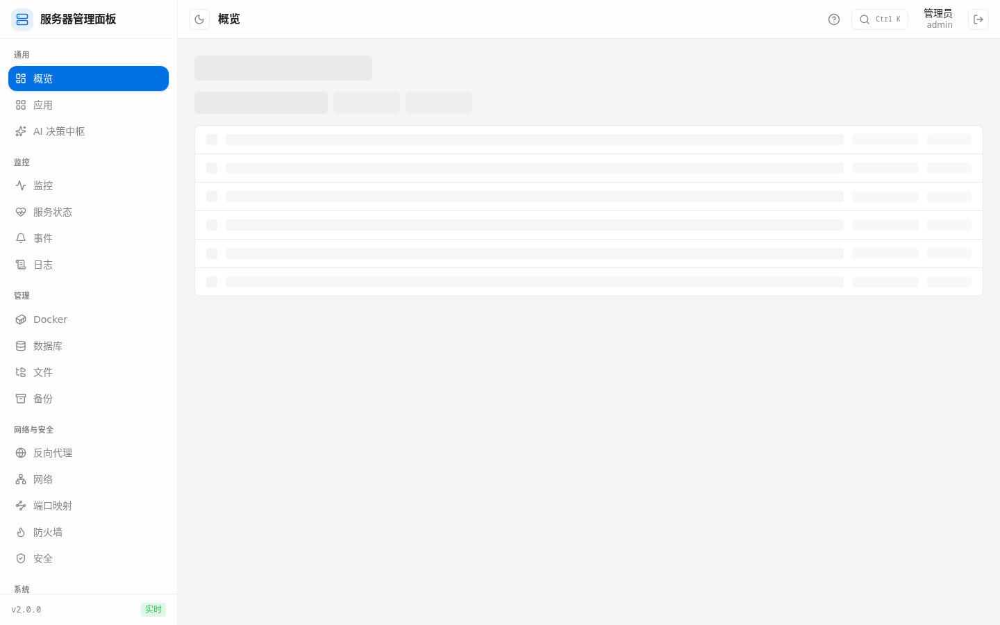
Live status, service cards, and maintenance widgets in one place.

</td>
<td width="50%">

**Applications**
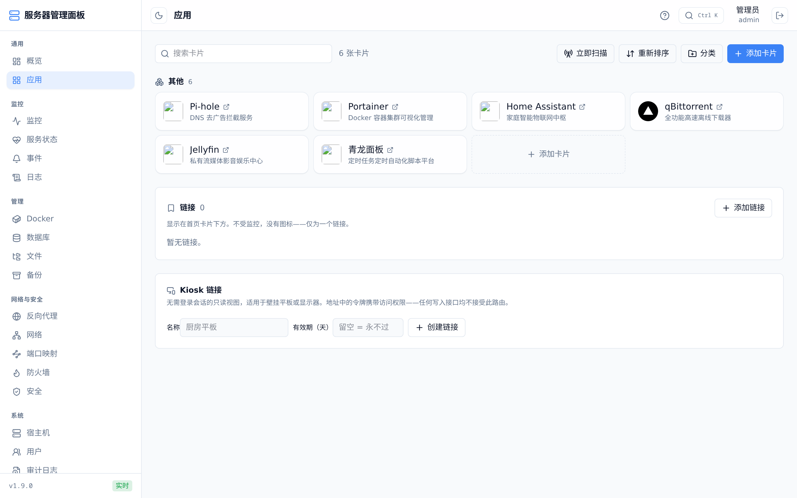
Quick access card dashboard with service status.

</td>
</tr>
<tr>
<td width="50%">

**Monitoring**
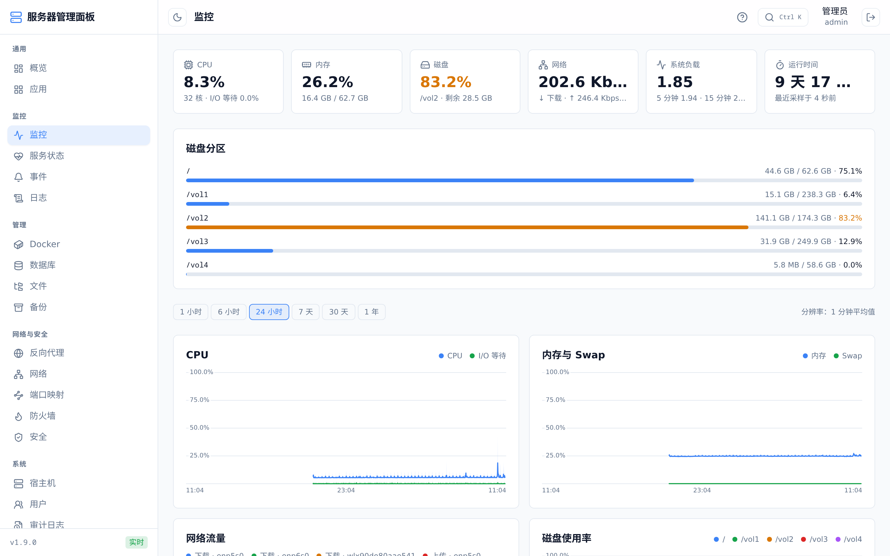
CPU, memory, disk and network history with adjustable time ranges.

</td>
<td width="50%">

**Docker**
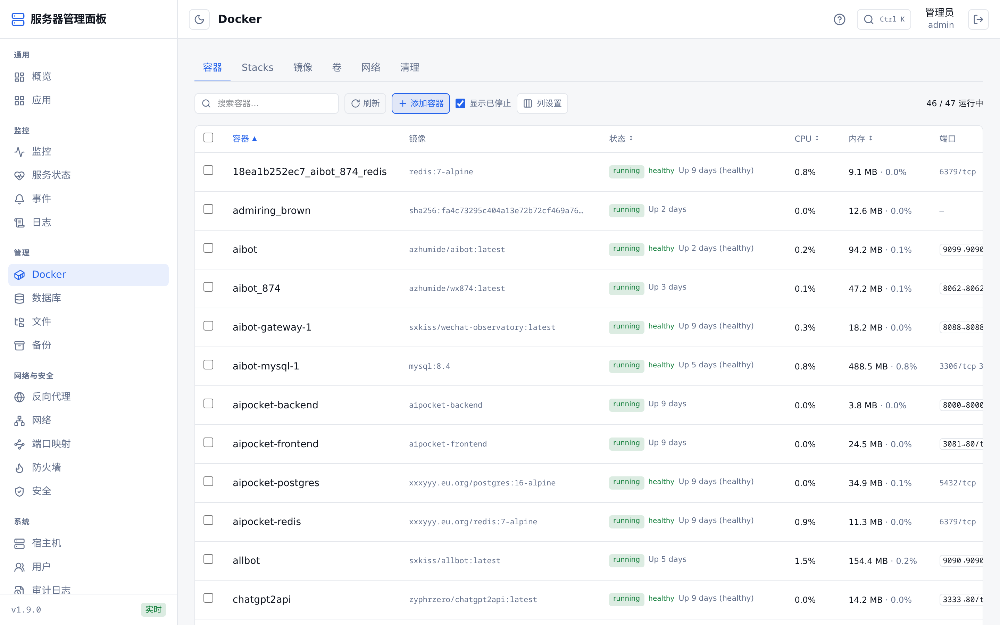
Container list with live status, CPU/memory, and quick actions.

</td>
</tr>
<tr>
<td width="50%">

**Service Status**
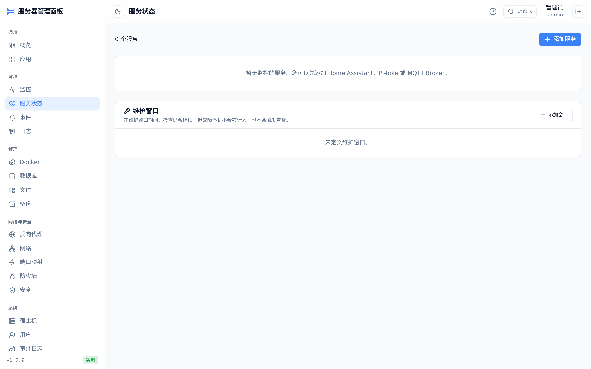
HTTP/TCP/ping/container probes with a 60-day uptime strip.

</td>
<td width="50%">

**Events**
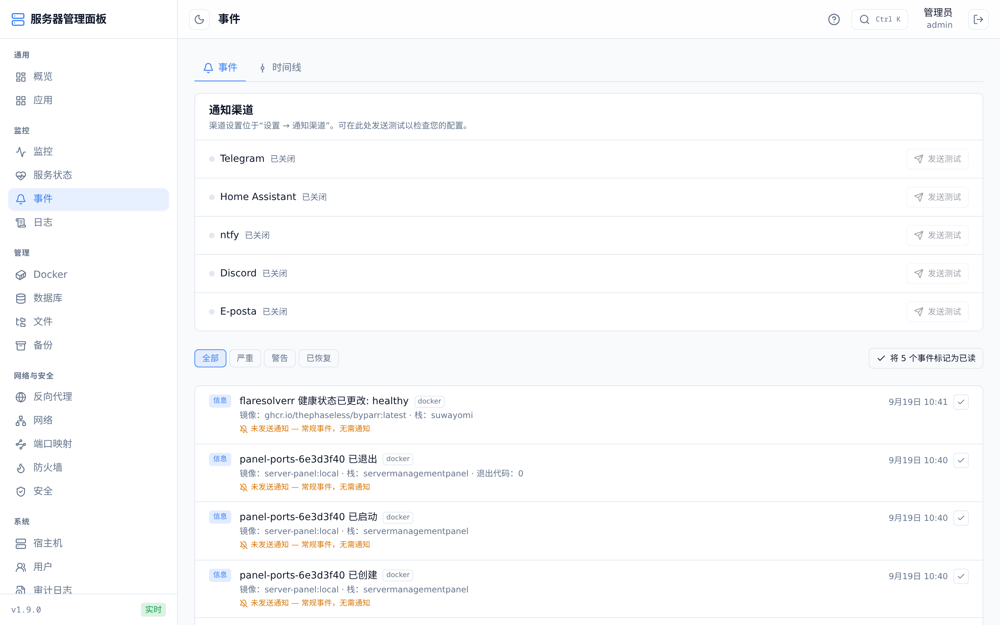
Notification channels and the merged event feed.

</td>
</tr>
<tr>
<td width="50%">

**Backup**
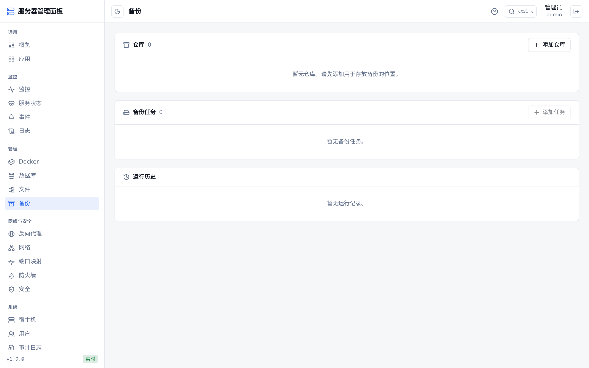
restic-based scheduled backups and run history.

</td>
<td width="50%">

**Server**
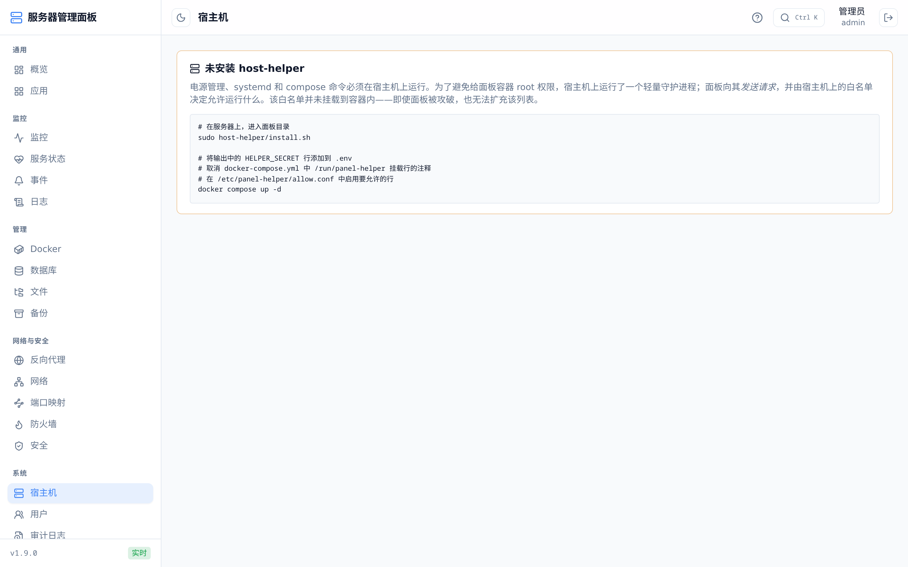
Console, power controls, systemd units, and compose stacks.

</td>
</tr>
<tr>
<td width="50%">

**Panel Jobs**
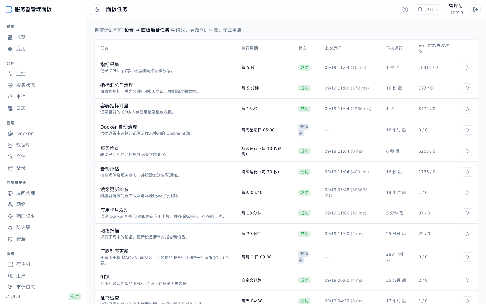
Background job schedule, status, and run/error counts.

</td>
<td width="50%">

**Host Tasks**
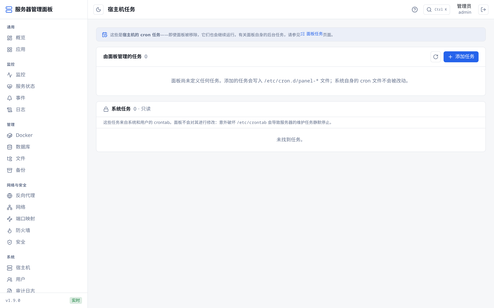
Panel-managed and host crontab tasks side by side.

</td>
</tr>
</table>

---

## Architecture

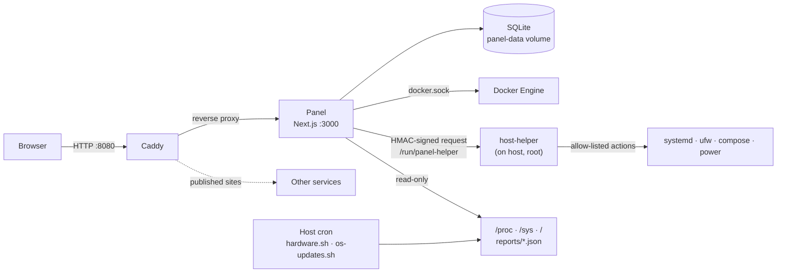

- **Caddy is the single entry point.** The panel container does not expose any port externally. Caddy serves the panel itself on the HTTP port. Sites published from the panel exit through the same Caddy instance with their own TLS settings. The panel writes its publishing rules to a separate file and `reload`s Caddy without restarting it. That way a bad rule can't break the panel's own entry point.
- **Operations that need host-level privilege are not done by giving the container root.** A small Python daemon (`host-helper`) running on the host accepts HMAC-SHA256–signed requests over a Unix socket. Which action is allowed to run is decided by `/etc/panel-helper/allow.conf` on the host. This file is not mounted into the container. The container does not send command text — only an action name and written arguments.
- **Data requiring raw disk access is produced on the host.** S.M.A.R.T/ZFS and OS update reports are written as JSON by scripts running in the host's cron. The panel only reads these files.
- **The database is embedded.** Node's built-in `node:sqlite` module is used in WAL mode; no native compilation is needed. Migrations are forward-only, and an automatic copy of the database is taken before each migration.
- **Secret values are encrypted.** Settings such as tokens and passwords are stored encrypted in the database with AES-256-GCM using `MASTER_KEY`.
- **Schema ready for multi-host, even though today only a single host is managed.** Every resource and time-series table has a `host_id` field.

---

## Security model

Read this section before installing. The panel exists to manage a server, and doing that job requires high privilege.

> [!WARNING]
> **The panel serves plain HTTP only.** Passwords, session cookies, and web terminal traffic travel **unencrypted** on the local network. Do not expose the panel directly to the internet. Use a VPN such as Tailscale for remote access. If you need HTTPS, it's enough to uncomment the panel block in the `Caddyfile` with `https://` addresses and a `tls` line — no other code change is required, since the session cookie's `secure` flag is read from the request scheme.

> [!WARNING]
> **Access to `docker.sock` is effectively root on the host.** The panel container has access to the Docker socket. The `:ro` flag does not prevent this, because API calls made through the socket cannot be made read-only. Anyone who compromises the panel has compromised the server. Use strong passwords and enable two-factor authentication.

Measures taken to limit this risk:

| Measure | Detail |
|---|---|
| RBAC | Every privileged action is tied to a separate permission. Built-in roles: `admin` (full access), `kullanici`/"user" (viewing and container operations; no terminal or host privileges), `izleyici`/"viewer" (view-only). Custom roles can be defined. |
| Audit log | Every action that makes a change is logged with who did it and when. Secret values are masked. |
| Session security | Login rate limiting, account lockout, CSRF protection on all mutating endpoints (double-submit cookie), session renewal after login, TOTP 2FA. |
| host-helper allow list | **Installed empty by default**, meaning the install grants the panel no host privileges at all. You decide which actions to enable. The panel-side permission and the host-side allow list are two separate gates; even if the panel is compromised, the second one still holds. |
| Protected containers | The panel's own container and the reverse-proxy container cannot be selected in bulk operations and are excluded from auto-update. |
| Secret encryption | Secret values in settings are encrypted with AES-256-GCM. `MASTER_KEY` is deliberately not included in backups. |

**Store `MASTER_KEY` somewhere separate from the panel.** If you lose it, encrypted settings (tokens, passwords) cannot be recovered. If you put it in the same backup as the database, the encryption's protection is void.

---

## Requirements

| Component | Note |
|---|---|
| Linux server | Developed and tested on Ubuntu or Debian. |
| Docker Engine + Compose v2 | The `docker compose` command. |
| Python 3 (on the host) | Only for host-helper. No dependencies outside the standard library. |
| `smartmontools` | Optional. For the S.M.A.R.T report. |
| Tailscale | Optional. If not installed, a line in the compose file must be commented out (see below). |

---

## Installation

### Quick Install (Prebuilt Image, Recommended)

For users who want to run the panel without cloning the repository or building from source:

```bash
curl -sSL https://raw.githubusercontent.com/xiaoxinkeji/ServerManagementPanel/main/install.sh | bash
```

Or deploy using `docker-compose.yml` pulling `ghcr.io/xiaoxinkeji/servermanagementpanel:latest`.

---

### Build and Run from Source (For Developers)

All the steps below are run **on the server**, in the directory where the panel will be installed.

### 1. Clone the repository

```bash
git clone https://github.com/xiaoxinkeji/ServerManagementPanel.git
cd ServerManagementPanel
```

### 2. Prepare the `.env` file

```bash
cp .env.example .env
```

Fill in at least these two values, both required:

```bash
# Secret encryption key (64 hex characters)
openssl rand -hex 32

# GID of the host's docker group
getent group docker | cut -d: -f3
```

```ini
MASTER_KEY=<openssl output>
DOCKER_GID=<getent output>
```

Pick ports on the server that aren't already in use. Defaults are `8080` (panel) and `8443` (TLS sites published from the panel):

```bash
ss -lntp | grep -E ':(8080|8443) '
```

See the [Environment variables](#environment-variables) section for the other variables.

### 3. If Tailscale is not installed

Comment out the following line in `docker-compose.yml`. Otherwise compose will fail to start:

```yaml
      # - /var/run/tailscale/tailscaled.sock:/run/tailscale/tailscaled.sock:ro
```

### 4. Start

```bash
docker compose up -d --build
```

On ARM64 servers, use the same command when installing from the GitHub source; it rebuilds the image on the target machine. If you use a prebuilt published image instead, make sure the image has an ARM64 manifest:

```bash
docker buildx imagetools inspect ghcr.io/<user>/<repo>:<tag>
```

If the output does not include `linux/arm64`, that image will not run on an ARM64 server; the usual errors are `exec format error` or `no matching manifest for linux/arm64`. Build from source with `docker compose up -d --build`, or use an image that has been republished as ARM64/multi-arch.

On first launch, the database schema is created and an admin account is opened. If `ADMIN_PASSWORD` was left blank, the randomly generated password is written to the container log:

```bash
docker compose logs panel
```

### 5. Log in

Open `http://<server-address>:8080` in a browser and log in with the `admin` user. You'll be asked to change the password on first login.

At this point the panel is functional for monitoring, Docker management, application cards, and notifications. Features that operate on the host (power, systemd, compose, firewall, server console, host cron) remain disabled until host-helper is installed, and the panel states this clearly on screen.

---

## Optional components

### host-helper

Required for compose stacks, systemd services, power operations, ufw, host crontab, journald reading, and the server console.

```bash
sudo host-helper/install.sh
```

The script does the following:

1. Copies `panel-helper.py` into `/usr/local/lib/panel-helper/`.
2. Generates a random shared secret under `/etc/panel-helper/secret` (`0600`, readable only by root).
3. Creates `/etc/panel-helper/allow.conf` **empty** (all lines commented out).
4. Installs and starts the `panel-helper` systemd unit.
5. Prints the `HELPER_SECRET` value you need to add to `.env`.

Then:

```bash
# add HELPER_SECRET=<value printed by the script> to the .env file
docker compose up -d
```

Remove the `#` in front of the actions you want to enable in `/etc/panel-helper/allow.conf`. The file is re-read on every request, so the service doesn't need to be restarted. You can restrict an action by giving an argument pattern:

```ini
# Status reads only
service.status
service.list

# Restart only specific units
service.restart ^(docker|ssh|cron)\.service$

# Compose only under this directory
compose.ps ^/home/USER/docker/
compose.up ^/home/USER/docker/
```

The full list of actions and each one's risk is explained inside the file itself. In particular, enabling the `shell.exec` line **without a pattern gives the panel a root shell on the host.** For protocol details, see [`host-helper/PROTOCOL.md`](host-helper/PROTOCOL.md).

### Hardware report (S.M.A.R.T / ZFS)

```bash
sudo apt install smartmontools
sudo install -m 700 scripts/hardware.sh /usr/local/bin/panel-hardware.sh
mkdir -p reports
sudo tee /etc/cron.d/panel-hardware <<EOF
*/30 * * * * root PANEL_REPORTS_DIR=$PWD/reports /usr/local/bin/panel-hardware.sh
EOF
```

### OS update report

The script does **not install** updates — it only reports what exists. Security patches are counted separately.

```bash
sudo install -m 700 scripts/os-updates.sh /usr/local/bin/panel-os-updates.sh
sudo tee /etc/cron.d/panel-os-updates <<EOF
17 6 * * * root PANEL_REPORTS_DIR=$PWD/reports /usr/local/bin/panel-os-updates.sh
EOF
```

The panel mounts the `reports/` directory as read-only.

### Access from the container to host ports (ufw)

On a server with ufw enabled, requests from the panel container to services running on the host network (e.g. Home Assistant on `:8123`) are dropped. If you want to poll such services, allow the relevant port for the panel's fixed subnet (`PANEL_SUBNET`, default `172.28.0.0/16`):

```bash
sudo ufw allow from 172.28.0.0/16 to any port 8123 proto tcp
```

---

## Environment variables

These are **deployment parameters**. Anything that can be changed from within the panel is managed in the Settings screen and stored in the database.

| Variable | Required | Default | Description |
|---|---|---|---|
| `MASTER_KEY` | ✅ | — | Secret encryption key, 64 hex characters. The panel won't start without it. |
| `DOCKER_GID` | ✅ | — | GID of the host's `docker` group. The panel runs as a non-root user (uid 1001). |
| `PANEL_HTTP_PORT` | | `8080` | The panel's port on the host. Set to `80` if you want a portless address. |
| `PANEL_HTTPS_PORT` | | `8443` | Only for TLS sites published from the panel. The panel itself is not served on this port. |
| `PANEL_SITE_ADDRESSES` | | `:80` | Addresses the panel will respond to. If left empty, it opens on every IP and hostname. Uncomment the line to restrict; don't give an empty value. |
| `ADMIN_USERNAME` | | `admin` | The admin account created on first install. |
| `ADMIN_PASSWORD` | | random | If blank, generated and written to the container log. |
| `HELPER_SECRET` | | — | host-helper's shared secret. If blank, host operations remain disabled. |
| `PANEL_SUBNET` | | `172.28.0.0/16` | The fixed subnet of the panel's container network. Kept fixed because ufw rules are written against it. |
| `PANEL_REPORTS_DIR` | | `./reports` | The directory where host cron scripts drop JSON output. |
| `TZ` | | `Europe/Istanbul` | Time zone. |
| `MOCK_MODE` | | `0` | If set to `1`, all providers that touch the outside world return fake data from `fixtures/`. For development and debugging. |
| `APP_VERSION` | | `1.9.0` | Version baked into the image. Visible in the `/api/health` response and the UI. |

---

## Updating and rolling back

```bash
git pull
docker compose up -d --build
```

If a new version brings a schema change, the panel takes a copy of the database **before** the migration, as `data/backups/pre-migration-<n>.db`. If a migration fails, the panel refuses to start and prints the rollback command to the console. Rolling back is done by restoring from that copy — there is no "down" migration.

The panel's persistent data lives in the `panel-data` volume. The panel's own SQLite backup can be taken consistently from the Backup screen via `VACUUM INTO`.

---

## Docker labels

The panel's behavior can be configured via labels written on containers or in the compose file. An unrecognized value falls back to the default, so a typo doesn't silently hide a container.

**Application card discovery** is opt-in. Only containers carrying `panel.enable=true` become a card:

```yaml
services:
  pihole:
    image: pihole/pihole
    labels:
      panel.enable: "true"
      panel.name: "Pi-hole"
      panel.port: "8081"
      panel.path: "/admin"
      panel.category: "Network"
      panel.description: "Ad-blocking DNS"
```

Available fields: `panel.name`, `.url`, `.port`, `.scheme`, `.path`, `.description`, `.category`, `.icon`, `.internal_url`. If no address is given, the first TCP port published by the container is used. If you edit a discovered card from the panel, the card becomes yours and discovery no longer touches it.

**Behavior labels:**

| Label | Effect |
|---|---|
| `panel.update=false` | Excludes the container from update checks and auto-update. |
| `panel.hidden=true` | Not shown in the container list. |
| `panel.notify=false` | Produces no notifications. |
| `panel.url` | Sets the link address. |
| `panel.port.<port>.url` | Sets the address for a single port badge. |
| `panel.order` | Sets the sort order. |
| `panel.prune=false` | If written on an image, it is not deleted during cleanup. |

---

## External API, Prometheus, and MQTT

- **`/api/v1`:** a versioned HTTP API, authenticated with `Authorization: Bearer`, for calling from your own scripts, Home Assistant, or n8n. **Disabled by default;** every endpoint returns `404` while disabled. Enable it under **Settings → External API**, and generate a key under **My Account → API Keys**. A key is tied to a user and carries a subset of that user's permissions. Details are in [`docs/API.md`](docs/API.md), with the machine-readable schema in [`docs/openapi.yaml`](docs/openapi.yaml).
- **Prometheus:** the `/metrics` endpoint exposes system metrics and, optionally, container metrics (**Settings → External Integration**).
- **MQTT:** metrics and events can be published to an MQTT broker. Home Assistant MQTT Discovery is supported; sensors appear automatically in Home Assistant.

---

## Languages

The interface language is chosen under **Settings → General → Language**. The setting applies to the whole installation, and the page reloads when it changes. Turkish and English are included.

Each language is a single JSON file under `src/locales/`. Keys are flat and contextual, so they say where the text is used:

```json
{
  "_meta.name": "English",
  "_meta.intl": "en-US",
  "nav.items.host": "Host",
  "nav.items.uptime": "Service Status",
  "common.duration.day.one": "{count} day",
  "common.duration.day.other": "{count} days"
}
```

- **Turkish (`tr.json`) is the source language.** Text with no translation in a language is shown in Turkish, never as a raw key.
- Placeholders such as `{count}` and `{name}` must be kept in translations. Text written as `${VARIABLE}` is not a placeholder and is shown as is.
- Plural forms use suffixes (`.one`, `.other`). A language can add the other categories it needs (`.few`, `.many`, etc.).

### Adding a language

1. Generate a draft. It is derived from the Turkish file and registered for you:
   ```bash
   npm run i18n:new -- fr "Français" fr-FR
   ```
   The language can be selected right away in Settings, marked as a draft ("Français (draft)").
2. Translate the **values** in `src/locales/fr.json`. Leave the keys and placeholders alone. You can hand the file directly to a translator, an LLM, or a tool such as Crowdin or Weblate.
3. Check progress. This lists missing, extra, and broken-placeholder entries:
   ```bash
   npm run i18n:check
   ```
4. When the translation is done, delete the `"_meta.status": "draft"` line. The language then counts as complete, and any missing text fails the tests and `i18n:check`.

> Parts of the panel have not been moved to the translation files yet. Those screens appear in Turkish whatever language is selected.

---

## Development

The entire panel can be developed on Windows or macOS without touching the server. With `MOCK_MODE=1`, the Docker, metrics, hardware, Tailscale, and host-helper providers all use fake data from `fixtures/`.

**Requirement:** Node.js 24 (for the built-in `node:sqlite` module).

```bash
npm ci
cp .env.example .env
# in .env:  MOCK_MODE=1  and  MASTER_KEY=<openssl rand -hex 32>
npm run dev
```

The panel opens at `http://localhost:3000`. The database is created under `./data/` (can be changed with `DATA_DIR`).

| Command | Function |
|---|---|
| `npm run dev` | Development server |
| `npm run build` | Production build (standalone output) |
| `npm run typecheck` | `tsc --noEmit` |
| `npm run lint` | ESLint |
| `npm test` | Unit tests (`node --test`, `src/**/*.test.ts`) |
| `npm run check:openapi` | Checks that the OpenAPI schema matches the route tree |

On every push, GitHub Actions ([`.github/workflows/ci.yml`](.github/workflows/ci.yml)) runs type checking, lint, tests, OpenAPI validation, and the build. It then builds the Docker image, brings up the container, and verifies that the `/api/health` endpoint responds.

> [!NOTE]
> The project uses **Next.js 16**. APIs, conventions, and file structure may differ from earlier versions in this release. Check the relevant guide under `node_modules/next/dist/docs/` before writing code.

### Contribution principles

- **Settings are never hardcoded.** A new threshold, interval, limit, or schedule is added as a single line in `src/settings.schema.ts`. The form, validation, and audit logging all come from this schema automatically.
- **Every module that touches the outside world sits behind a provider interface** (`src/lib/providers/*.live.ts` and `*.mock.ts`). A new integration ships together with its mock implementation.
- **Schema changes are numbered migrations** (`src/lib/db/migrations/`). An existing migration is never edited — a new one is added instead.
- Design decisions and their rationale are kept per milestone in [`PLAN.md`](PLAN.md).

---

## 致谢与贡献

本项目在原作者 `xiaoxinkeji` 的架构、功能设计与早期实现基础上持续演进。后续维护工作主要围绕中文运维体验、可靠性、安全边界、Docker 生命周期管理和 AI 辅助运维能力展开。

感谢原作者为项目打下的基础，也感谢 Next.js、React、TypeScript、Docker、Caddy、SQLite 及相关开源项目的维护者与贡献者。所有新增改动均尽量保持原有架构约束，并通过测试、类型检查、Lint、OpenAPI 校验和生产构建进行验证。

如果你基于本项目继续开发，欢迎保留原作者及上游项目的版权、许可证和贡献说明，并在提交功能改动时补充清晰的变更记录。

---

## Project structure

```
├── Caddyfile                # Entry point; imports the publishing rules the panel generates
├── Dockerfile                # Multi-stage build, Debian slim, non-root user, healthcheck
├── docker-compose.yml        # panel + caddy, mounts and their rationale
├── .env.example               # Deployment parameters
├── docs/                     # API.md + openapi.yaml
├── fixtures/                  # MOCK_MODE fake data
├── host-helper/               # panel-helper.py, install.sh, PROTOCOL.md
├── scripts/                   # hardware.sh, os-updates.sh (host cron), check-openapi.mjs
└── src/
    ├── instrumentation.ts    # Startup: MASTER_KEY check, migration, initial admin
    ├── settings.schema.ts    # Single source of truth for all settings
    ├── app/
    │   ├── (panel)/           # Screens requiring a session (docker, monitoring, backup, …)
    │   ├── api/                # Internal API endpoints + api/v1 (external API)
    │   ├── login/ kiosk/ metrics/
    ├── components/             # Screen components (docker, settings, shell, …)
    └── lib/                    # Business logic: auth, db, docker, compose, jobs, alerts,
                                # notify, backup, proxy, network, security, providers, …
```

---

## Known limitations

- **Single server.** The schema is ready for multi-host, but the interface and providers today only manage the server the panel runs on.
- **Panel is plain HTTP.** A deliberate decision: a locally-signed CA certificate isn't trusted by any device, so it triggered a browser warning on every visit. See [Security model](#security-model).
- **The web terminal doesn't use WebSocket.** Since Next.js 16 route handlers can't upgrade a connection, output is carried over SSE and input over POST. Terminal sessions are kept in memory, which is why the panel must run as a single long-lived Node process — it cannot be moved to a serverless environment.
- **Network discovery isn't as thorough as `arp-scan`.** Since the panel container can't send raw ARP packets, TCP probing and the host's ARP table are used instead.
- **Wake-on-LAN broadcast packets don't reach the LAN through the Docker bridge.** A directed broadcast address (e.g. `192.168.1.255`) needs to be entered.
- **Hardware paths couldn't be verified on a virtual machine.** The temperature, S.M.A.R.T, and RAID code was written for physical hardware and tested with fixtures.

---

## Documentation

| Document | Content |
|---|---|
| [`PLAN.md`](PLAN.md) | Roadmap, architectural decisions (T1–T14), and the rationale for each milestone |
| [`docs/API.md`](docs/API.md) | External API guide: keys, permission model, curl, Prometheus, and Home Assistant examples |
| [`docs/openapi.yaml`](docs/openapi.yaml) | OpenAPI schema for `/api/v1` |
| [`host-helper/PROTOCOL.md`](host-helper/PROTOCOL.md) | host-helper protocol: transport, signing, request/response format |
