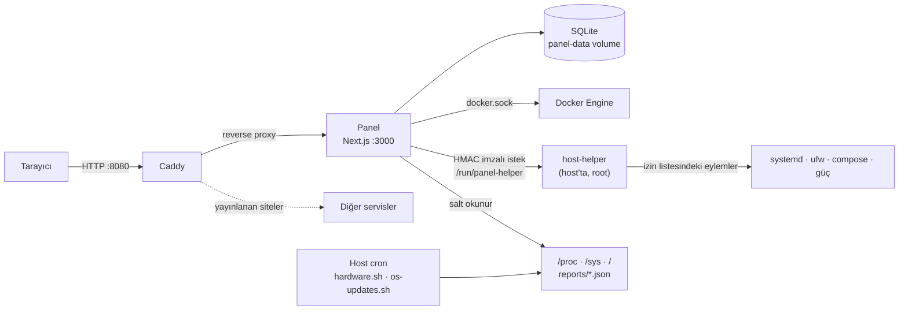

# Sunucu Yönetim Paneli

[English](README.md) · [Türkçe](README_tr.md) · [简体中文](README_zh.md)

Tek bir Linux + Docker sunucusu için yazılmış, kendi sunucunda barındırdığın bir yönetim paneli. İzleme, alarm, Docker ve compose yönetimi, servislere hızlı erişim, yedekleme, güvenlik duvarı, dosya ve veritabanı yönetimini tek arayüzde toplar.

Ev sunucusu (homelab) ölçeği düşünülerek tasarlandı: tek container, gömülü SQLite, harici veritabanı ya da kuyruk yok. Arayüz ve tüm metinler Türkçedir.

> **Sürüm:** 2.0.0 · **Yığın:** Next.js 16, React 19, TypeScript, Tailwind CSS 4, Node 24 (`node:sqlite`)

---

## İçindekiler

- [Özellikler](#özellikler)
- [Mimari](#mimari)
- [Güvenlik modeli](#güvenlik-modeli)
- [Gereksinimler](#gereksinimler)
- [Kurulum](#kurulum)
- [İsteğe bağlı bileşenler](#i̇steğe-bağlı-bileşenler)
- [Ortam değişkenleri](#ortam-değişkenleri)
- [Güncelleme ve geri alma](#güncelleme-ve-geri-alma)
- [Docker etiketleri](#docker-etiketleri)
- [Dış API, Prometheus ve MQTT](#dış-api-prometheus-ve-mqtt)
- [Dil desteği](#dil-desteği)
- [Geliştirme](#geliştirme)
- [Proje yapısı](#proje-yapısı)
- [Bilinen sınırlar](#bilinen-sınırlar)
- [Belgeler](#belgeler)

---

## Özellikler

### Genel

- **Genel Bakış:** anlık CPU, bellek, disk ve ağ kullanımı, container sayısı, açık alarmlar, işletim sistemi ve image güncellemeleri, son yedeğin zamanı ve seçtiğin kartlar.
- **Uygulamalar:** sunucudaki servislere tek tıkla gitmek için kart panosu. Kategoriler, sıralama, logo yükleme ve karta bağlı canlı durum noktası var. Docker etiketiyle kartlar otomatik keşfedilir. Pi-hole gibi servisler için kart üstünde widget gösterilir.
- **Ana sayfa ve kiosk:** kartlar ile yer imlerini birlikte arayan bir arama kutusu, saat, hava durumu (Open-Meteo, anahtar gerekmez) ve "internet çalışıyor mu?" göstergesi. Duvardaki tablet için oturum gerektirmeyen, salt okunur, token'lı bir kiosk adresi (`/kiosk/<token>`) de var.
- **Komut paleti:** `Ctrl+K` / `Cmd+K` ile her ekrana ve işleme hızlıca ulaşılır.

### İzleme

- **İzleme:** CPU, bellek, disk, ağ ve sıcaklık geçmişi. Metrikler katmanlı saklanır: ham veri 24 saat, 1 dakikalık 7 gün, 1 saatlik 90 gün, 1 günlük 24 ay. Süreler ayarlardan değiştirilebilir. Disk, RAM ve CPU için kapasite tahmini yapılır ("disk 12 gün sonra dolabilir").
- **Donanım sağlığı:** sensör sıcaklıkları, mdraid, S.M.A.R.T ve ZFS havuz durumu. Sanal makinede panel boş kutu göstermez, sebebini yazar.
- **Servis Durumu:** HTTP, TCP, ping, DNS ve container yoklamaları. 60 günlük kullanılabilirlik şeridi ve bakım pencereleri var.
- **Olaylar ve bildirimler:** Telegram, Home Assistant, ntfy, Discord ve e-posta kanalları, her biri kendi seviye filtresiyle. Yanlış alarm yağmurunu önlemek için dalgalanma (flap) koruması, tekrar bastırma, sessiz saatler ve çözülmeyen kritik alarmların tekrar hatırlatılması uygulanır. **Zaman çizelgesi** denetim kaydını, olayları ve metrik sıçramalarını tek şeritte birleştirir ("22:00'de şu ayar değişti, 22:05'te şu container çöktü").
- **Loglar:** container logları ve journald tek yerde toplanır, SQLite FTS5 ile aranır. Aksan duyarsızdır: "olcum" yazınca "ölçüm" bulunur. Log desenine bağlı alarm kuralı tanımlanabilir.

### Yönetim

- **Docker:** Container, Stack, Image, Volume, Ağ ve Temizlik sekmeleri.
  - Container'ları başlatma, durdurma, yeniden başlatma, silme ve toplu işlem.
  - Canlı log (ANSI renkleriyle), container içinde web terminal (xterm.js), container içi dosya tarayıcı ve düzenleyici, container başına kaynak grafikleri.
  - **Konteyner ekleme:** bir compose dosyasından ya da çekilen bir image'dan formu ön doldurup düzenleyerek container oluşturma.
  - **Compose düzenleyici:** port, ağ, ortam değişkeni ve yeniden başlatma politikası formdan düzenlenir. Kaydetmeden önce satır satır fark gösterilir, yedek alınır ve başarısız olursa geri dönülür.
  - Compose'suz bir container'dan `docker-compose.yml` üretme.
  - Tek tıkla image güncelleme: yeni container ayağa kalkmazsa eski container otomatik geri getirilir. Kayıt defterinden yeni sürüm etiketi tespit edilir. Güncellemeden önce isteğe bağlı CVE kontrolü yapılır.
  - Restart döngüsü ve OOM tespiti, image katman yığını görselleştirmesi, volume klonlama ve dışa aktarma, ağ haritası.
- **Stack / App store:** kendi `docker-compose.yml` dosyanı kurmak ve kurulu yığınları yönetmek (`compose up`, `pull`, `restart`, `down`). Kurulumdan önce port çakışması gibi ön kontroller yapılır.
- **Veritabanı:** PostgreSQL, MySQL/MariaDB ve SQLite veritabanlarına bağlanma, tablo gezme, sorgu çalıştırma ve sonucu dışa aktarma.
- **Dosyalar:** ayarlarda izin verilen kök dizinler altında göz atma, indirme, yükleme ve düzenleme.
- **Yedekleme:** restic tabanlı zamanlanmış yedekler. Dizin ve Docker volume seçimi, saklama politikası, S3/rclone uzak hedef, snapshot listeleme ve tek tıkla geri yükleme var. restic host'a kurulmaz; her komut tek seferlik bir `restic/restic` container'ında çalışır.

### Ağ ve Güvenlik

- **Proxy:** bir alan adını sunucudaki bir servise yönlendirme (Caddy, Let's Encrypt ya da yerel CA). Sertifika bitiş takibi ve dinamik DNS (Cloudflare, DuckDNS) de burada.
- **Ağ:** yerel ağ cihaz keşfi ve envanteri (MAC→üretici eşlemesiyle), yeni bilinmeyen cihaz bildirimi, Wake-on-LAN, hız testi geçmişi ve Tailscale peer durumu.
- **Port Haritası:** hangi portu hangi container ya da sistem servisinin tuttuğu ve yeni bir container'a verilecek boş portlar.
- **Güvenlik Duvarı:** ufw kurallarını görüntüleme, ekleme ve silme, varsayılan politikayı değiştirme.
- **Güvenlik:** açık portlar, SSH anahtarları, fail2ban ve başarısız giriş denemeleri, UPnP yönlendirmeleri, image'larda Trivy ile bilinen zafiyet (CVE) taraması.

### Sistem

- **Sunucu:** hazır komut kalıpları ve isteğe bağlı serbest komut içeren sunucu konsolu, sistem bilgisi, systemd servisleri, yeniden başlatma ve kapatma.
- **Host Görevleri:** host'un kendi crontab'ını yönetme. Ham cron ifadesi yerine "her N günde bir, saat 06:17" gibi dostane bir zamanlama düzenleyicisi kullanılır.
- **Kullanıcılar ve roller:** çoklu kullanıcı, özel roller ve izin bazlı erişim (RBAC), TOTP iki adımlı doğrulama, açık oturumların listesi.
- **Denetim Kayıtları:** kim, ne zaman, neyi değiştirdi. Filtrelenebilir ve CSV olarak dışa aktarılabilir.
- **Panel İşleri:** arka planda çalışan işlerin (metrik toplama, rollup, health-check, yedekleme, sertifika kontrolü, ağ taraması…) son sonuçları ve elle tetikleme.
- **Ayarlar:** 180'i aşkın ayar tek bir şemadan (`src/settings.schema.ts`) otomatik çizilir ve 20 kategoriye ayrılır. Eşik, aralık, saklama süresi ve zamanlamaların hiçbiri koda sabit yazılmaz. Her değişiklik denetim kaydına düşer. Ayarlar varsayılana döndürülebilir, JSON olarak dışa ve içe aktarılabilir.

---

## Mimari



- **Tek giriş noktası Caddy'dir.** Panel container'ı dışarıya port açmaz. Caddy panelin kendisini HTTP portunda sunar. Panelden yayınlanan siteler kendi TLS ayarlarıyla aynı Caddy üzerinden çıkar. Panel yayın kurallarını ayrı bir dosyaya yazar ve Caddy'yi yeniden başlatmadan `reload` eder. Böylece hatalı bir kural panelin kendi girişini bozamaz.
- **Host'ta yetki gerektiren işler container'a root verilerek yapılmaz.** Host'ta çalışan küçük bir Python daemon'ı (`host-helper`) Unix soketi üzerinden HMAC-SHA256 imzalı istekleri kabul eder. Hangi eylemin çalışacağına host'taki `/etc/panel-helper/allow.conf` karar verir. Bu dosya container'a mount edilmez. Container komut metni göndermez, yalnızca eylem adı ve yazılı argümanlar gönderir.
- **Ham disk erişimi isteyen veriler host'ta üretilir.** S.M.A.R.T/ZFS ve işletim sistemi güncelleme raporları host cron'unda çalışan betiklerle JSON olarak yazılır. Panel bu dosyaları yalnızca okur.
- **Veritabanı gömülüdür.** Node'un yerleşik `node:sqlite` modülü WAL modunda kullanılır, native derleme gerekmez. Migration'lar ileri yönlüdür ve her migration'dan önce veritabanının otomatik bir kopyası alınır.
- **Gizli değerler şifrelenir.** Token ve parola gibi ayarlar veritabanında `MASTER_KEY` ile AES-256-GCM şifreli tutulur.
- **Çoklu host'a hazırlıklı şema.** Bugün tek sunucu yönetiliyor. Buna rağmen tüm kaynak ve zaman serisi tablolarında `host_id` alanı var.

---

## Güvenlik modeli

Kurmadan önce bu bölümü oku. Panel bir sunucuyu yönetmek için var ve bu işi yapabilmesi yüksek yetki gerektiriyor.

> [!WARNING]
> **Panel yalnızca düz HTTP sunar.** Parolalar, oturum çerezi ve web terminal trafiği yerel ağda **şifresiz** taşınır. Paneli doğrudan internete açma. Uzaktan erişim için Tailscale gibi bir VPN kullan. HTTPS gerekiyorsa `Caddyfile`'daki panel bloğunu `https://` adresleriyle ve `tls` satırıyla geri çevirmen yeterli; oturum çerezinin `secure` bayrağı isteğin şemasından okunduğu için kodda başka değişiklik gerekmez.

> [!WARNING]
> **`docker.sock` erişimi pratikte host'ta root demektir.** Panel container'ı Docker soketine erişir. `:ro` bayrağı bunu engellemez, çünkü soket üzerinden giden API çağrıları salt okunur yapılamaz. Paneli ele geçiren biri sunucuyu da ele geçirmiş olur. Güçlü parolalar kullan ve iki adımlı doğrulamayı aç.

Bu riski sınırlamak için alınan önlemler:

| Önlem | Ayrıntı |
|---|---|
| RBAC | Her yetkili işlem ayrı bir izne bağlı. Hazır roller: `admin` (tam yetki), `kullanici` (görüntüleme ve container işlemleri; terminal ve host yetkisi yok), `izleyici` (yalnızca görüntüleme). Özel rol tanımlanabilir. |
| Denetim kaydı | Değişiklik yapan her işlem kim ve ne zaman bilgisiyle kaydedilir. Gizli değerler maskelenir. |
| Oturum güvenliği | Giriş hız sınırı, hesap kilitleme, tüm değiştirici uçlarda CSRF koruması (double-submit cookie), girişten sonra oturum yenileme, TOTP 2FA. |
| host-helper izin listesi | **Varsayılan olarak boş kurulur**, yani kurulum panele host'ta hiçbir yetki vermez. Hangi eylemin açılacağına sen karar verirsin. Panel tarafındaki izin ve host tarafındaki izin listesi iki ayrı kapıdır; panel ele geçirilse bile ikincisi durur. |
| Korumalı container'lar | Panelin kendi container'ı ve reverse proxy container'ı toplu işlemlerde seçilemez ve otomatik güncellemeye girmez. |
| Secret şifreleme | Ayarlardaki gizli değerler AES-256-GCM ile şifrelenir. `MASTER_KEY` yedeklere bilerek dahil edilmez. |

**`MASTER_KEY`'i panel dışında ayrı bir yerde sakla.** Kaybedersen şifreli ayarlar (token'lar, parolalar) geri getirilemez. Veritabanıyla aynı yedeğe koyarsan da şifrelemenin koruması kalmaz.

---

## Gereksinimler

| Bileşen | Not |
|---|---|
| Linux sunucu | Ubuntu ya da Debian üzerinde geliştirildi ve sınandı. |
| Docker Engine + Compose v2 | `docker compose` komutu. |
| Python 3 (host'ta) | Yalnızca host-helper için. Standart kütüphane dışında bağımlılığı yok. |
| `smartmontools` | İsteğe bağlı. S.M.A.R.T raporu için. |
| Tailscale | İsteğe bağlı. Kurulu değilse compose dosyasında bir satır yoruma alınmalı (aşağıya bak). |

---

## Kurulum

Aşağıdaki adımların hepsi **sunucuda**, panelin kurulacağı dizinde çalıştırılır.

### 1. Depoyu klonla

```bash
git clone https://github.com/xiaoxinkeji/ServerManagementPanel.git
cd ServerManagementPanel
```

### 2. `.env` dosyasını hazırla

```bash
cp .env.example .env
```

En az şu iki değeri doldur, ikisi de zorunlu:

```bash
# Secret şifreleme anahtarı (64 hex karakter)
openssl rand -hex 32

# Host'un docker grubunun GID'i
getent group docker | cut -d: -f3
```

```ini
MASTER_KEY=<openssl çıktısı>
DOCKER_GID=<getent çıktısı>
```

Sunucuda dolu olmayan portları seç. Varsayılanlar `8080` (panel) ve `8443` (panelden yayınlanan TLS'li siteler):

```bash
ss -lntp | grep -E ':(8080|8443) '
```

Diğer değişkenler için [Ortam değişkenleri](#ortam-değişkenleri) bölümüne bak.

### 3. Tailscale kurulu değilse

`docker-compose.yml` içindeki şu satırı yoruma al. Aksi halde compose ayağa kalkmaz:

```yaml
      # - /var/run/tailscale/tailscaled.sock:/run/tailscale/tailscaled.sock:ro
```

### 4. Başlat

```bash
docker compose up -d --build
```

ARM64 sunucuda GitHub'daki kaynak koddan kurulum için de aynı komut kullanılmalı; bu komut imajı hedef makinede yeniden derler. Önceden yayınlanmış hazır bir imaj kullanıyorsan imajın ARM64 manifest'i olduğundan emin ol:

```bash
docker buildx imagetools inspect ghcr.io/<kullanici>/<repo>:<etiket>
```

Çıktıda `linux/arm64` görünmüyorsa ARM64 sunucuda o imaj çalışmaz; genellikle `exec format error` ya da `no matching manifest for linux/arm64` hatası alınır. Bu durumda kaynak koddan `docker compose up -d --build` ile derle veya ARM64/multi-arch olarak yeniden yayınlanmış imajı kullan.

İlk açılışta veritabanı şeması oluşturulur ve yönetici hesabı açılır. `ADMIN_PASSWORD` boş bırakıldıysa rastgele üretilen parola container loguna yazılır:

```bash
docker compose logs panel
```

### 5. Giriş yap

Tarayıcıda `http://<sunucu-adresi>:8080` adresini aç ve `admin` kullanıcısıyla giriş yap. İlk girişte parolayı değiştirmen istenir.

Panel bu noktada izleme, Docker yönetimi, uygulama kartları ve bildirimlerle çalışır durumdadır. Host üzerinde işlem yapan özellikler (güç, systemd, compose, güvenlik duvarı, sunucu konsolu, host cron) host-helper kurulana kadar kapalıdır ve panel bunu ekranda açıkça söyler.

---

## İsteğe bağlı bileşenler

### host-helper

Compose yığınları, systemd servisleri, güç işlemleri, ufw, host crontab'ı, journald okuma ve sunucu konsolu için gerekir.

```bash
sudo host-helper/install.sh
```

Betik şunları yapar:

1. `panel-helper.py`'yi `/usr/local/lib/panel-helper/` altına kopyalar.
2. `/etc/panel-helper/secret` altında rastgele bir paylaşılan sır üretir (`0600`, yalnızca root okuyabilir).
3. `/etc/panel-helper/allow.conf` dosyasını **boş** (tüm satırlar yorumda) oluşturur.
4. `panel-helper` systemd birimini kurup başlatır.
5. `.env`'e yazman gereken `HELPER_SECRET` değerini ekrana basar.

Ardından:

```bash
# .env dosyasına HELPER_SECRET=<betiğin verdiği değer> ekle
docker compose up -d
```

Açmak istediğin eylemlerin başındaki `#` işaretini `/etc/panel-helper/allow.conf` içinde kaldır. Dosya her istekte yeniden okunur, servisi yeniden başlatmak gerekmez. Argüman deseni vererek bir eylemi daraltabilirsin:

```ini
# Yalnızca durum okuma
service.status
service.list

# Yalnızca belirli birimleri yeniden başlatma
service.restart ^(docker|ssh|cron)\.service$

# Compose yalnızca bu dizinin altında
compose.ps ^/home/KULLANICI/docker/
compose.up ^/home/KULLANICI/docker/
```

Eylemlerin tam listesi ve her birinin riski dosyanın içinde açıklanıyor. Özellikle `shell.exec` satırını **desensiz açmak panele host'ta root kabuğu vermek demektir.** Protokolün ayrıntıları için [`host-helper/PROTOCOL.md`](host-helper/PROTOCOL.md) dosyasına bak.

### Donanım raporu (S.M.A.R.T / ZFS)

```bash
sudo apt install smartmontools
sudo install -m 700 scripts/hardware.sh /usr/local/bin/panel-hardware.sh
mkdir -p reports
sudo tee /etc/cron.d/panel-hardware <<EOF
*/30 * * * * root PANEL_REPORTS_DIR=$PWD/reports /usr/local/bin/panel-hardware.sh
EOF
```

### İşletim sistemi güncelleme raporu

Betik güncelleme **kurmaz**, yalnızca ne olduğunu raporlar. Güvenlik yamaları ayrıca sayılır.

```bash
sudo install -m 700 scripts/os-updates.sh /usr/local/bin/panel-os-updates.sh
sudo tee /etc/cron.d/panel-os-updates <<EOF
17 6 * * * root PANEL_REPORTS_DIR=$PWD/reports /usr/local/bin/panel-os-updates.sh
EOF
```

Panel `reports/` dizinini salt okunur olarak bağlar.

### Container'dan host portlarına erişim (ufw)

ufw açık bir sunucuda, panel container'ından host ağında çalışan servislere (ör. `:8123`'teki Home Assistant) giden istekler düşürülür. Bu servislere yoklama yapmak istiyorsan, panelin sabit alt ağına (`PANEL_SUBNET`, varsayılan `172.28.0.0/16`) ilgili port için izin ver:

```bash
sudo ufw allow from 172.28.0.0/16 to any port 8123 proto tcp
```

---

## Ortam değişkenleri

Buradakiler **dağıtım parametreleridir**. Panelden değiştirilebilen her şey Ayarlar ekranında yönetilir ve veritabanında tutulur.

| Değişken | Zorunlu | Varsayılan | Açıklama |
|---|---|---|---|
| `MASTER_KEY` | ✅ | — | Secret şifreleme anahtarı, 64 hex karakter. Yoksa panel açılmaz. |
| `DOCKER_GID` | ✅ | — | Host'un `docker` grubunun GID'i. Panel root olmayan kullanıcıyla (uid 1001) çalışır. |
| `PANEL_HTTP_PORT` | | `8080` | Panelin host'taki portu. Portsuz adres istiyorsan `80` yap. |
| `PANEL_HTTPS_PORT` | | `8443` | Yalnızca panelden yayınlanan TLS'li siteler için. Panel bu portta sunulmaz. |
| `PANEL_SITE_ADDRESSES` | | `:80` | Panelin cevap vereceği adresler. Boş bırakılırsa her IP ve host adıyla açılır. Sınırlamak için satırın yorumunu kaldır; boş değer verme. |
| `ADMIN_USERNAME` | | `admin` | İlk kurulumda oluşturulan yönetici. |
| `ADMIN_PASSWORD` | | rastgele | Boşsa üretilip container loguna yazılır. |
| `HELPER_SECRET` | | — | host-helper paylaşılan sırrı. Boşsa host işlemleri kapalıdır. |
| `PANEL_SUBNET` | | `172.28.0.0/16` | Panel container ağının sabit alt ağı. ufw kuralları buna göre yazıldığı için sabit tutulur. |
| `PANEL_REPORTS_DIR` | | `./reports` | Host cron betiklerinin JSON bıraktığı dizin. |
| `TZ` | | `Europe/Istanbul` | Saat dilimi. |
| `MOCK_MODE` | | `0` | `1` yapılırsa dış dünyaya dokunan tüm sağlayıcılar `fixtures/` altındaki sahte veriyi döndürür. Geliştirme ve sorun ayıklama içindir. |
| `APP_VERSION` | | `1.9.0` | İmaja gömülen sürüm. `/api/health` yanıtında ve arayüzde görünür. |

---

## Güncelleme ve geri alma

```bash
git pull
docker compose up -d --build
```

Yeni bir sürüm şema değişikliği getiriyorsa panel, migration'dan **önce** veritabanının kopyasını `data/backups/pre-migration-<n>.db` olarak alır. Migration başarısız olursa panel açılmayı reddeder ve konsola geri dönüş komutunu yazar. Geri alma bu kopyadan geri yükleyerek yapılır; "down" migration yoktur.

Panelin kalıcı verisi `panel-data` volume'ünde durur. Panelin kendi SQLite yedeği Yedekleme ekranından `VACUUM INTO` ile tutarlı biçimde alınabilir.

---

## Docker etiketleri

Panelin davranışı container'lara ya da compose dosyasına yazılan etiketlerle ayarlanabilir. Tanınmayan bir değer varsayılana düşer. Bu yüzden bir yazım hatası bir container'ı sessizce gizlemez.

**Uygulama kartı keşfi** isteğe bağlıdır (opt-in). Yalnızca `panel.enable=true` taşıyan container kart olur:

```yaml
services:
  pihole:
    image: pihole/pihole
    labels:
      panel.enable: "true"
      panel.name: "Pi-hole"
      panel.port: "8081"
      panel.path: "/admin"
      panel.category: "Ağ"
      panel.description: "Reklam engelleyici DNS"
```

Kullanılabilen alanlar: `panel.name`, `.url`, `.port`, `.scheme`, `.path`, `.description`, `.category`, `.icon`, `.internal_url`. Adres verilmezse container'ın yayınladığı ilk TCP portu kullanılır. Keşfedilen bir kartı panelden düzenlersen kart senin olur ve keşif bir daha ona dokunmaz.

**Davranış etiketleri:**

| Etiket | Etkisi |
|---|---|
| `panel.update=false` | Container güncelleme kontrolü ve otomatik güncellemenin dışında kalır. |
| `panel.hidden=true` | Container listesinde gösterilmez. |
| `panel.notify=false` | Bildirim üretmez. |
| `panel.url` | Bağlantı adresini belirler. |
| `panel.port.<port>.url` | Tek bir port rozetinin adresini belirler. |
| `panel.order` | Sıralamayı belirler. |
| `panel.prune=false` | Image'a yazılırsa temizlikte silinmez. |

---

## Dış API, Prometheus ve MQTT

- **`/api/v1`:** kendi betiklerinden, Home Assistant'tan ya da n8n'den çağırmak için sürümlenmiş, `Authorization: Bearer` ile çalışan bir HTTP API. **Varsayılan olarak kapalıdır;** kapalıyken her uç `404` döner. Açmak için **Ayarlar → Dış API**, anahtar üretmek için **Hesabım → API Anahtarları**. Anahtar bir kullanıcıya bağlıdır ve o kullanıcının izinlerinin bir alt kümesini taşır. Ayrıntılar [`docs/API.md`](docs/API.md) dosyasında, makine okunur şema [`docs/openapi.yaml`](docs/openapi.yaml) dosyasında.
- **Prometheus:** `/metrics` ucu sistem ve isteğe bağlı olarak container metriklerini yayınlar (**Ayarlar → Dış Entegrasyon**).
- **MQTT:** metrikler ve olaylar bir MQTT broker'ına yayınlanabilir. Home Assistant MQTT Discovery desteklenir; sensörler Home Assistant'ta kendiliğinden belirir.

---

## Dil desteği

Arayüz dili **Ayarlar → Genel → Dil** altından seçilir; ayar kurulum genelindedir ve değiştirilince sayfa yeniden yüklenir. Türkçe ve İngilizce hazır gelir.

Her dil `src/locales/` altında tek bir JSON dosyasıdır. Anahtarlar düz ve bağlamlıdır, yani metnin nerede kullanıldığını söyler:

```json
{
  "_meta.name": "Türkçe",
  "_meta.intl": "tr-TR",
  "nav.items.host": "Sunucu",
  "nav.items.uptime": "Servis Durumu",
  "common.duration.day.one": "{count} gün",
  "common.duration.day.other": "{count} gün"
}
```

- **Türkçe (`tr.json`) kaynak dildir.** Bir dilde çevirisi olmayan metin ekranda Türkçe görünür, ham anahtar olarak görünmez.
- `{count}`, `{name}` gibi yer tutucular çeviride korunmalıdır. `${DEĞİŞKEN}` biçimindeki metin yer tutucu değildir, olduğu gibi gösterilir.
- Çoğul biçimler son ekle yazılır (`.one`, `.other`). Dilin gerektirdiği diğer kategoriler (`.few`, `.many` vb.) eklenebilir.

### Yeni dil ekleme

1. Taslağı üret. Türkçe dosyadan türetilir ve kayda eklenir:
   ```bash
   npm run i18n:new -- fr "Français" fr-FR
   ```
   Dil, Ayarlar'da "Français (taslak)" olarak hemen seçilebilir hâle gelir.
2. `src/locales/fr.json` içindeki **değerleri** çevir. Anahtarlara ve yer tutuculara dokunma. Dosya bir çevirmene, bir LLM'e ya da Crowdin/Weblate gibi bir araca doğrudan verilebilir.
3. İlerlemeyi denetle. Eksik, fazla ve yer tutucusu bozuk metinleri listeler:
   ```bash
   npm run i18n:check
   ```
4. Çeviri bitince dosyadaki `"_meta.status": "draft"` satırını sil. Dil tamamlanmış sayılır; bundan sonra eksik metin testlerde ve `i18n:check`te hata verir.

> Panelin bir kısmı henüz çeviri dosyalarına taşınmadı. Bu ekranlar seçili dilden bağımsız olarak Türkçe görünür.

---

## Geliştirme

Panelin tamamı Windows'ta ya da macOS'ta sunucuya gitmeden geliştirilebilir. `MOCK_MODE=1` ile Docker, metrik, donanım, Tailscale ve host-helper sağlayıcıları `fixtures/` altındaki sahte veriyi kullanır.

**Gereksinim:** Node.js 24 (yerleşik `node:sqlite` modülü için).

```bash
npm ci
cp .env.example .env
# .env içinde:  MOCK_MODE=1  ve  MASTER_KEY=<openssl rand -hex 32>
npm run dev
```

Panel `http://localhost:3000` adresinde açılır. Veritabanı `./data/` altında oluşturulur (`DATA_DIR` ile değiştirilebilir).

| Komut | İşlev |
|---|---|
| `npm run dev` | Geliştirme sunucusu |
| `npm run build` | Üretim derlemesi (standalone çıktı) |
| `npm run typecheck` | `tsc --noEmit` |
| `npm run lint` | ESLint |
| `npm test` | Birim testleri (`node --test`, `src/**/*.test.ts`) |
| `npm run check:openapi` | OpenAPI şemasının route ağacıyla uyuşup uyuşmadığını denetler |

Her push'ta GitHub Actions ([`.github/workflows/ci.yml`](.github/workflows/ci.yml)) tip kontrolü, lint, testler, OpenAPI doğrulaması ve derleme çalıştırır. Ardından Docker imajını derler, container'ı ayağa kaldırır ve `/api/health` ucunun yanıt verdiğini doğrular.

> [!NOTE]
> Proje **Next.js 16** kullanıyor. Bu sürümde API'ler, kurallar ve dosya yapısı önceki sürümlerden farklı olabilir. Kod yazmadan önce `node_modules/next/dist/docs/` altındaki ilgili rehbere bak.

### Katkı ilkeleri

- **Ayarlar koda sabit yazılmaz.** Yeni bir eşik, aralık, limit ya da zamanlama `src/settings.schema.ts` dosyasına bir satır olarak eklenir. Form, doğrulama ve denetim kaydı bu şemadan kendiliğinden gelir.
- **Dış dünyaya dokunan her modül bir sağlayıcı arayüzünün arkasındadır** (`src/lib/providers/*.live.ts` ve `*.mock.ts`). Yeni bir entegrasyon mock uygulamasıyla birlikte gelir.
- **Şema değişiklikleri numaralı migration'dır** (`src/lib/db/migrations/`). Mevcut bir migration düzenlenmez, yenisi eklenir.
- Tasarım kararları ve gerekçeleri [`PLAN.md`](PLAN.md) dosyasında milestone bazında tutulur.

---

## Proje yapısı

```
├── Caddyfile                # Giriş noktası; panelin ürettiği yayın kurallarını import eder
├── Dockerfile               # Çok aşamalı derleme, Debian slim, root olmayan kullanıcı, healthcheck
├── docker-compose.yml       # panel + caddy, mount'lar ve gerekçeleri
├── .env.example             # Dağıtım parametreleri
├── docs/                    # API.md + openapi.yaml
├── fixtures/                # MOCK_MODE sahte verileri
├── host-helper/             # panel-helper.py, install.sh, PROTOCOL.md
├── scripts/                 # hardware.sh, os-updates.sh (host cron), check-openapi.mjs
└── src/
    ├── instrumentation.ts   # Açılış: MASTER_KEY kontrolü, migration, ilk yönetici
    ├── settings.schema.ts   # Tüm ayarların tek kaynağı
    ├── app/
    │   ├── (panel)/         # Oturum gerektiren ekranlar (docker, monitoring, backup, …)
    │   ├── api/             # İç API uçları + api/v1 (dış API)
    │   ├── login/ kiosk/ metrics/
    ├── components/          # Ekran bileşenleri (docker, settings, shell, …)
    └── lib/                 # İş mantığı: auth, db, docker, compose, jobs, alerts,
                             # notify, backup, proxy, network, security, providers, …
```

---

## Bilinen sınırlar

- **Tek sunucu.** Şema çoklu host'a hazır, ama arayüz ve sağlayıcılar bugün yalnızca panelin çalıştığı sunucuyu yönetiyor.
- **Panel düz HTTP.** Bilinçli bir karar: yerel CA'lı sertifika hiçbir cihazda tanınmadığı için her ziyarette tarayıcı uyarısı çıkarıyordu. Bkz. [Güvenlik modeli](#güvenlik-modeli).
- **Web terminal WebSocket kullanmıyor.** Next.js 16 route handler'ları bağlantı yükseltemediği için çıktı SSE ile, giriş POST ile taşınıyor. Terminal oturumları bellekte tutulur. Bu yüzden panel uzun ömürlü tek bir Node süreci olarak çalışmalıdır; sunucusuz bir ortama taşınamaz.
- **Ağ keşfi `arp-scan` kadar eksiksiz değil.** Panel container'ı ham ARP paketi gönderemediği için TCP yoklaması ve host'un ARP tablosu kullanılır.
- **Wake-on-LAN yayın paketi Docker köprüsünden LAN'a ulaşmaz.** Yönlendirilmiş yayın adresi (ör. `192.168.1.255`) girilmesi gerekir.
- **Donanım yolları sanal makinede doğrulanamadı.** Sıcaklık, S.M.A.R.T ve RAID kodu fiziksel donanım için yazıldı ve fixture'larla sınandı.

---

## Belgeler

| Belge | İçerik |
|---|---|
| [`PLAN.md`](PLAN.md) | Yol haritası, mimari kararlar (T1–T14) ve her milestone'un gerekçesi |
| [`docs/API.md`](docs/API.md) | Dış API rehberi: anahtarlar, yetki modeli, curl, Prometheus ve Home Assistant örnekleri |
| [`docs/openapi.yaml`](docs/openapi.yaml) | `/api/v1` OpenAPI şeması |
| [`host-helper/PROTOCOL.md`](host-helper/PROTOCOL.md) | host-helper protokolü: taşıma, imza, istek/yanıt biçimi |
